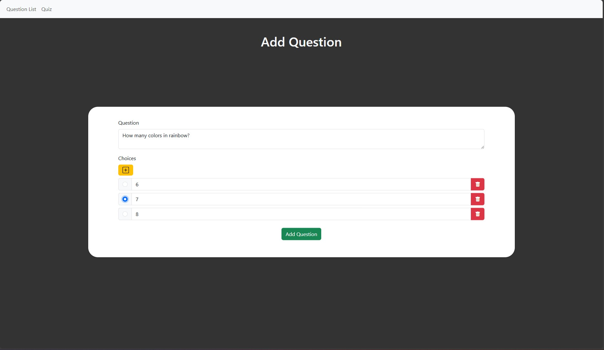

# Quiz Maker
This is a web program build using Flask where you can create quiz and answer them. 

1. To start, clone this repository

    git clone https://github.com/shirousaberx/quiz-maker.git

2. Import **quiz_maker.sql** database to MySQL

3. Then, open quiz-maker folder and create python virtual environment

    python -m venv env

4. Activate the virtual environment (example below uses powershell)

    ./env\Scripts\Activate.ps1

5. Go to project folder

    cd project

6. Run the Flask

    flask run

7. Finally put this URL in your browser
   
    localhost:5000

# Project Details
**Features**

You can add, delete, and edit quiz questions. You can add different number of choices to each question.

After you answer the quiz, there will be summary of correct choice and incorrect choice.

**Database name**

quiz_maker

# Screenshot

 - Question list

 - Add question

 - Start quiz

- Answer question

- Show score
